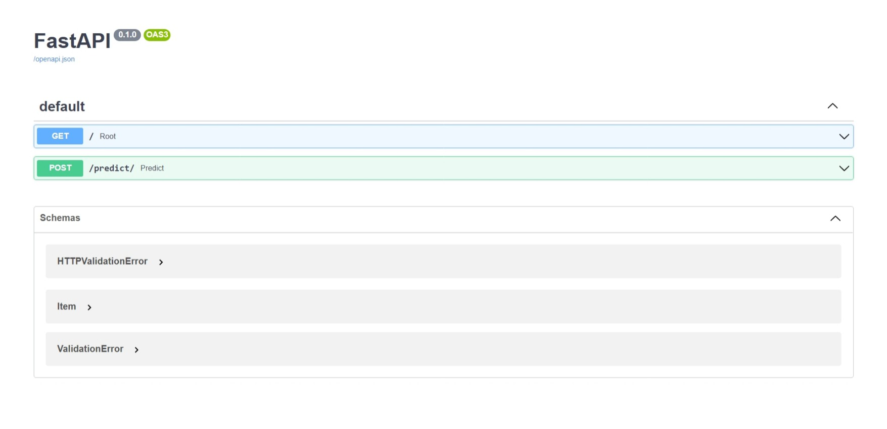
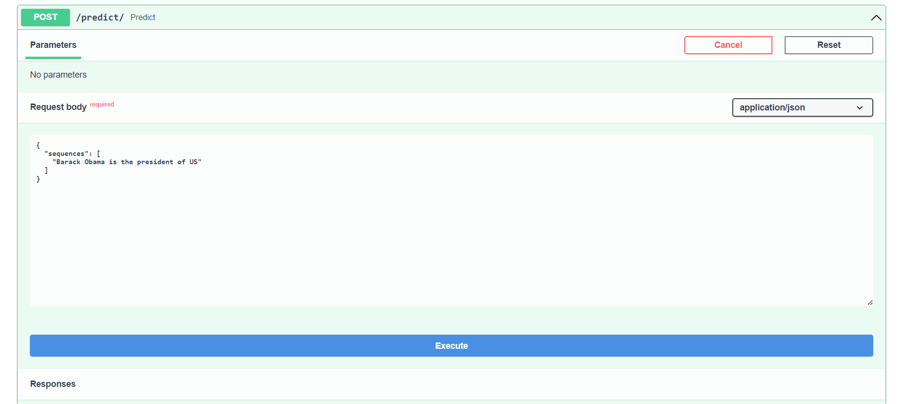
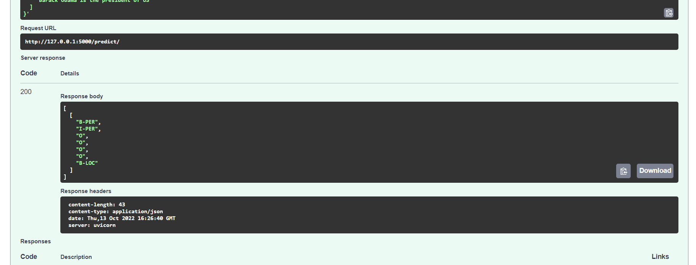

# kmthachner: Named Entity Regconition API

kmthachner is a Python-based product serve  API to create a **Local Host Server** implement **Named Entity Recognition** task in Natural Language Processing (NLP).

Models are trained on [CONLL-2003 Dataset](https://huggingface.co/datasets/conll2003) with using soft models (<4MB).

The pipepline of models is based on papers listed in Documention directory.

For building models, I use [Pytorch](https://pytorch.org/) - An open-source **machine learning framework** developed by [Meta AI](https://ai.facebook.com/).

Back-end is built based on [FastAPI](https://fastapi.tiangolo.com/) - A Modern Web Framework For Production.


---

**Documentation**: [https://github.com/kmthach/kmthachner/tree/main/docs](https://github.com/kmthach/kmthachner/tree/main/docs)

**Source Code**: [https://github.com/kmthach/kmthachner/tree/main/kmthachner](https://github.com/kmthach/kmthachner/tree/main/kmthachner)

---
## Models Evaluation Results
**API's Models are trained with hyperparameters:**

Total Epochs: 30

Batch Size: 32

Learning Rate: 0.001

Gradient Clipping: 15.0

Dropout: 0.5

**Then evaluate models on Test Dataset use F1, Precision, Recall as metrics.**

| Models                                                 | F1           | Precision    | Recall       |
|--------------------------------------------------------|--------------|--------------|--------------|
| GloVe + BiLSTM (Base)                                  | 82.44        | 83.25        | 81.64        |
| Base + CNNs Character Embedding                        | 87.91        | 87.14        | 88.70        |
| Base + LSTM Character Embedding                        | 83.54        | 84.03        | 83.06        |
| Base + CNNs Character Embedding + Casing Feature       | 89.02        | 88.07        | 89.99        |
| Base + LSTM Character Embedding + Casing Feature       | 88.14        | 87.09        | 89.22        |
| **Base + CNNs Character Embedding + Casing Feature + CRF (Best Model)** | **90.11**    | **89.59**    | **90.63**    |
| Base + LSTM Character Embedding + Casing Feature + CRF | 88.97        | 88.35        | 89.6         |

## Install kmthachner

Use the package manager [pip](https://pip.pypa.io/en/stable/) to install kmthachner.

``` bash
pip install kmthachner
```

## Usage

### For Initialize a Server
```python
from kmthachner.api import server
model_mode = 5 # [0, 1, 2, 3, 4, 5, 6]
device_mode = 0 # [0, 1]
server.start(model_mode, device_mode)
```
After runing the above code, if module start server successfully, you will get some logs like this:
```log
INFO:     Started server process [19172]
INFO:     Waiting for application startup.
INFO:     Application startup complete.
INFO:     Uvicorn running on http://127.0.0.1:5000 (Press CTRL+C to quit)
```
Then, open the local host address ( Example: http://127.0.0.1:5000/docs#/default) in your browser to test the server.



To post a requests click on POST > Change the json as below:



Finally, click Execute to get the predictions:


### For Make Predictions
```python
from kmthachner.api import predictor
model_mode = 5 # [0, 1, 2, 3, 4, 5, 6]
device_mode = 0 # [0, 1]
my_predictor = predictor.Predictor(model_mode, device_mode)
sequences = ['Barack Obama is the first president of the US', 'Mark Zuckerberg is the founder of Facebook']
my_predictor.predict(sequences)
```
**Parameters:**

model_mode: an integer in [0:6] (Default is 5) is the type of model to use. At present, we support models as table given below.

device_mode: 0 or 1 (Default is 1) is setting the using the device to CPU (0) or GPU (1).

port: an integer for port (Default is 5000).

| Models                                                 | Mode |
|--------------------------------------------------------|------|
| GloVe + BiLSTM (Base)                                  | 0    |
| Base + CNNs Character Embedding                        | 1    |
| Base + LSTM Character Embedding                        | 2    |
| Base + CNNs Character Embedding + Casing Feature       | 3    |
| Base + LSTM Character Embedding + Casing Feature       | 4    |
| **Base + CNNs Character Embedding + Casing Feature + CRF (Default)** | 5    |
| Base + LSTM Character Embedding + Casing Feature + CRF | 6    |


## Contributing

Pull requests are welcome. For major changes, please open an issue first to discuss what you would like to change.

Please make sure to update tests as appropriate.

Pay attention: please replace the glove.6B.100d.txt file with the file in [glove.6B.zip](https://nlp.stanford.edu/data/glove.6B.zip).
## License
[MIT](https://choosealicense.com/licenses/mit/)

